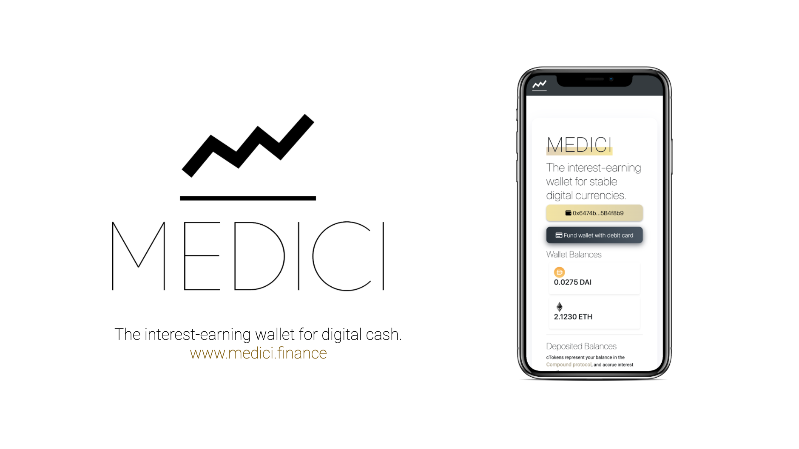
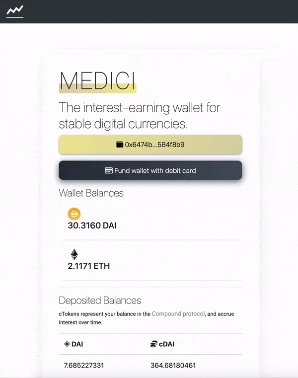
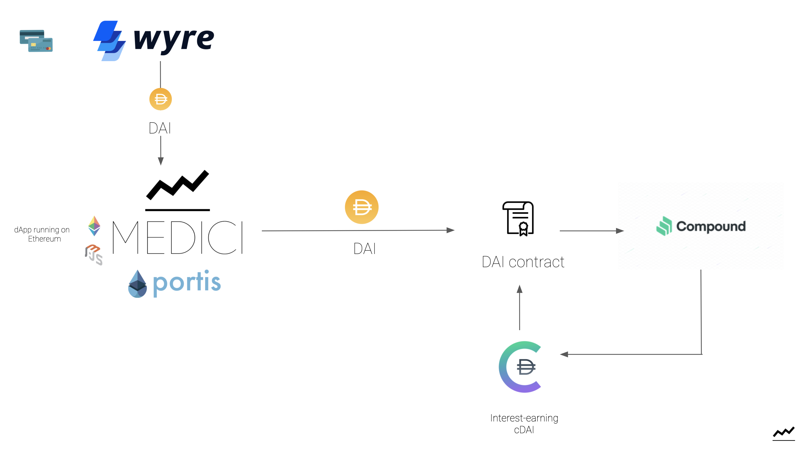

# MEDICI
https://www.medici.finance
[Demo](https://youtu.be/TsaYFR7vudI)

## About
With decentralized finance, anyone with an internet connection can set up an account to store and exchange value.

Medici is a simple wallet that allows users to convert their fiat money into stable digital assets and earn interest by supplying to the Compound Protocol.

By embedding a non-custodial wallet like Portis, Medici users can interact with the blockchain without the intimidating details. They create a crypto wallet with just an email and password. 

Medici also allows users to purchase digital assets through a debit card. The same goes for "cashing out": Users can payout to their bank account or card in fiat currency. It’s meant to be extremely user-friendly and simple. 

Medici values accessibility for international users—often, those who are the most in need for decentralized finance. To get started, Medici allows anyone to fund a crypto wallet with their debit card. The funds are then converted into a digital asset such as a stablecoin (DAI, USDC) and deposited into Compound. 

What is unique about Medici? Simplicity and focus.

1. We’re starting with USD stablecoins such as DAI, USD Coin and USDT.

2. We also think that certain regions outside the US and Europe can use a lot more help, which is why we’ve also prototyped the service in Brazilian Portuguese and Chinese.

3. We have spoken to dozens of potential users, who are extremely concerned about the rise in the price of imports, worried about the depreciation of their domestic currency, and are interested in holding assets like gold or the USD.

## How it's made
Medici is a dApp running on the Ethereum blockchain (currently on the Rinkeby testnet). It is a Node.js app using web3.js for interacting with smart contracts.

**Technologies used:**
- Web3.js
- Portis
- Compound cETH contract, cDAI contract
- Compound API
- DAI contract on Rinkeby
- Wyre

The user's account information is retrieved on page load, based on the Portis object. If the user does not yet have a Portis account, they can create one. They will also have to authenticate Medici via their Portis wallet. Thanks to the simplicity of Portis, the user can go through the onboarding flow leaving the Medici app. 

A user creates a wallet in seconds with a username and password, then funds it with some crypto, such as the DAI stablecoin. The user can purchase that crypto using a debit card via Wyre. 

To start earning interest, the DAI is supplied to the Compound protocol and converted into cDAI, which increases in value with every Ethereum block. To “cash out”, we simply redeem cDAI for DAI from Compound. 

For supplying and redeeming ETH: Use the Compound cETH contract's `mint()` and `redeem()` functions.

For supplying and redeeming DAI: Call the DAI contract's `approve()` function to allow Compound to obtain DAI on behalf o the user. Then use the Compound cDAI contract's `mint()` and `redeem()` functions. 

The Compound API (CTokenService) is used to obtain exchange rates as well as supply interest rates. 

For more progress updates: https://www.medici.finance/blog

## [cTokens](https://compound.finance/ctokens)

### Portable Balances
cTokens represent balance in the Compound protocol. Accrue interest over time
As a market earns interest, its cToken becomes convertible into an increasing quantity of the underlying asset.

For example, you minted some cETH by supplying ETH to Compound. As the Ether market on compound earns interest, the cETH tokens become convertible into more ETH.

Each market has its own supply interest rate (APR). You earn interest when you hold cTokens.

cTokens accumulate interest through their exchange rate. 
Over time, each cToken becomes convertible into increasing amount of its underlying asset. 
So even if the number of cTokens in your wallet stays the same, the value of your holding increases.

**Example**
If you supply 1,000 DAI to the Compound protocol when the exchange rate is 0.020070, you would receive 1,000/0.020070 = 49,825.61 cDAI

A few months later, you decide its time to withdraw your DAI and the exchange rate is now 0.021591
- Your 49,825.61 cDAI is now equal to 49,825.61*0.021591 = 1,075.78 DAI -> A 7.6% increase 

### Useful Collateral
By holding or receiving cToken, you can borrow from the Compound protocol.